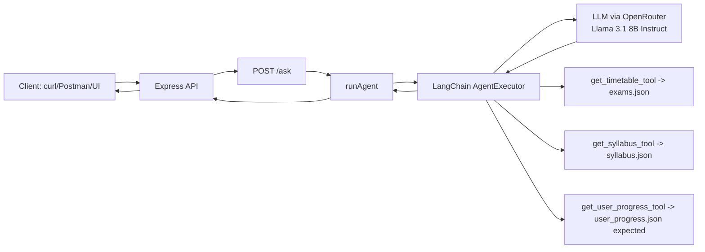
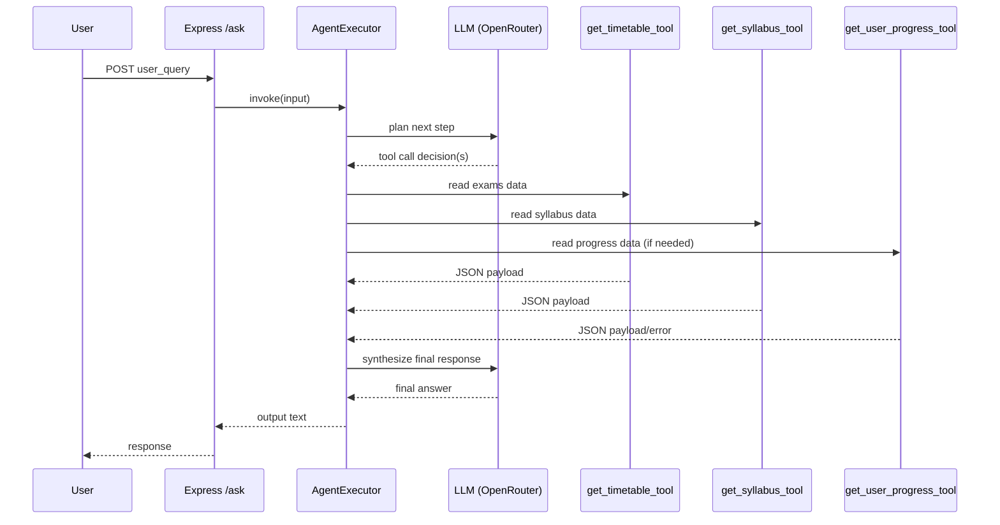

# AI Study Planner Agent - Project Dossier

## Introduction
This project implements a lightweight LLM-powered academic planning agent for a student (Alex). The system exposes a REST API that accepts natural language study queries and generates planning/advisory responses based on structured local academic data.

The codebase is intentionally small and demonstrates a modern agent pattern with tool-calling, prompt steering, and runtime traces through LangChain.

## Abstract of Problem Statement
Students often have fragmented study information:
- exam schedule in one place,
- syllabus details in another,
- progress status in another.

The problem is to combine these sources and provide actionable study guidance through natural language interaction. The solution is an agent that reads structured data via tools and returns personalized plans (for example, revision plans by exam date or pending topic analysis).

## Scope and Goal
- Build an academic planning assistant with natural language input.
- Keep architecture simple, inspectable, and easy to demo.
- Use local JSON files as reliable, deterministic tool data sources.
- Serve the agent through an HTTP API for integration or UI expansion.

## AI Framework(s) Used
- LangChain (core + agents + tools abstraction)
- OpenRouter as model gateway
- LLM wrapper: @langchain/openai ChatOpenAI client

Model configured in code:
- meta-llama/llama-3.1-8b-instruct
- temperature: 0.3

Why this stack:
- LangChain provides built-in tool-calling agent orchestration.
- OpenRouter allows quick model routing using a unified API.
- Llama 3.1 8B Instruct is fast/cost-effective for this assignment-scale workload.

## Language, Runtime, Framework, and Ecosystem
- Language: TypeScript
- Runtime: Node.js
- API Framework: Express 5
- Module system: ESM (type: module)
- Dev runner: tsx watch
- Config loading: dotenv

## Tools Integrated with Agent
Defined as LangChain DynamicTool objects:
1. get_timetable_tool
- Reads exams.json
- Returns exam schedule with current date

2. get_syllabus_tool
- Reads syllabus.json
- Returns subject/module/topic breakdown with current date

3. get_user_progress_tool
- Intended to read user_progress.json and return completed topics with current date

Note:
- Current repository file is named user_progess.json (spelling mismatch), but tool code references user_progress.json. This is a defect to fix.

## Data Sources
Local JSON files are used as knowledge sources:
- exams.json
- syllabus.json
- user_progess.json (typo in filename)

Data characteristics:
- exams.json: exam date/time/duration/room/notes per subject
- syllabus.json: hierarchical syllabus (subject -> modules -> topics)
- user progress file: completed topics by subject for Alex

## API Surface
### 1) GET /
- Health route
- Response text: healthy

### 2) POST /ask
- Request body:
```json
{
  "user_query": "Create a 5-day math-focused revision plan for Alex before exams."
}
```
- Response: plain text agent output

Observed behavior:
- Study planning queries return plan-like responses.
- Off-topic query test ("Tell me a movie recommendation") returned: "U better study Alex".

## How the Project Was Built
1. Created a TypeScript + Express service as API host.
2. Added LangChain agent with tool-calling interface.
3. Integrated OpenRouter-backed chat model.
4. Implemented local data tools reading JSON files.
5. Added prompt steering with role/task guardrail.
6. Exposed /ask endpoint to invoke runAgent().
7. Ran app in dev mode and tested with curl requests.

## Part A - Agent Design (Modern View)
### Goal of the Agent
Provide personalized academic planning and revision guidance from schedule, syllabus, and progress context.

### Agent Role
A study-planner assistant dedicated to Alex. It should prioritize academic tasks and discourage irrelevant conversation.

### Tools Used
- get_timetable_tool
- get_syllabus_tool
- get_user_progress_tool

These tools provide deterministic context retrieval from JSON sources.

### Memory Type (Short-Term / Context)
- Short-term conversational context only (via request + agent scratchpad).
- No persistent long-term memory store is implemented in the application.

### Planning Strategy
- ReAct-like iterative execution via LangChain AgentExecutor
- maxIterations: 6
- Tool-calling decisions are delegated to the model with intermediate scratchpad state.

## Part B - Implementation (Modern AI Tools)
### LLM-Based Agent
Configured in agent.ts through ChatOpenAI:
- model: meta-llama/llama-3.1-8b-instruct
- provider endpoint: https://openrouter.ai/api/v1
- API key env var: OPENROUTER_API_KEY

Justification:
- Good balance for instruction-following and cost/speed in a classroom demo.
- Supports tool-calling orchestration through LangChain wrapper.

### Tools Used: Justification and Features
1. DynamicTool abstraction
- Minimal boilerplate
- Easy to add file-based data adapters
- Human-readable description enables model tool selection

2. JSON local data model
- Deterministic outputs
- No external DB dependency
- Easy to inspect and update for demos

3. Express API layer
- Clean integration point for frontend or Postman/curl
- Fast local testing loop

### Multi-Step Reasoning
The runtime flow is:
1. User prompt arrives at POST /ask.
2. runAgent() obtains singleton AgentExecutor.
3. Agent plans whether to call tools.
4. Tool outputs are incorporated into scratchpad.
5. LLM synthesizes final answer.
6. API returns text response.

### Architecture Diagram


### Tool Flow Diagram


### Observable Agent Behavior (Logs / Traces)
- LangChain verbose tracing is enabled in AgentExecutor (verbose: true).
- Logs include chain start/end, parser output, token usage, and model metadata.
- Example observed metadata:
  - model name: meta-llama/llama-3.1-8b-instruct
  - prompt/completion token accounting present

## Code Repository / Notebook
- Repository: https://github.com/AnamayNarkar/AI-Lab-CA-1.git
- Notebook: not used in current implementation (code-first Node/TypeScript service).

## Agent Interaction Logs (Sample Requests/Outputs)
### Request 1
Input:
- Create a 5-day math-focused revision plan for Alex before exams.

Observed output summary:
- Returned a day-by-day plan across calculus, linear algebra, statistics, and review practice.

### Request 2
Input:
- What syllabus topics are still pending for Computer Science and Physics?

Observed output summary:
- Returned topic-level pending/completed style response for both subjects.

### Request 3
Input:
- Plan a 3-day revision for all subjects in order of exam dates.

Observed output summary:
- Returned date-ordered subject revision blocks over 3 days.

### Request 4 (Off-topic guardrail)
Input:
- Tell me a movie recommendation

Observed output:
- U better study Alex

## Discussion
### Strengths
- Small, understandable architecture ideal for educational evaluation.
- Real tool-calling pattern (not only prompt stuffing).
- Clear API contract and reproducible local data.

### Limitations
- No robust error handling around invalid request shapes or tool file failures.
- Typo mismatch for user progress filename can break intended tool retrieval.
- No persistent memory, authentication, or rate limiting.
- Prompt text has spelling/grammar issues and strict domain behavior.

### Recommended Improvements
1. Fix filename mismatch (user_progess.json vs user_progress.json).
2. Add request validation (e.g., reject missing user_query).
3. Add structured JSON responses with status and metadata.
4. Add test suite for tools and API routes.
5. Add persistent student profile storage and session history.

## Takeaway
This project demonstrates a practical modern-agent baseline: LLM + tool-calling + API wrapper. It is a strong foundation for extending into a full academic assistant with robust planning, progress tracking, and deployment readiness.

## Topic Name - Conclusion
### Topic Name
AI-Powered Academic Planner Agent using LangChain and Tool Calling

### Conclusion
The implementation successfully shows how modern LLM agents can be grounded with structured local tools to solve a focused real-world problem. With minor production hardening (validation, reliability, testing), this architecture can evolve from assignment prototype to usable student productivity assistant.
